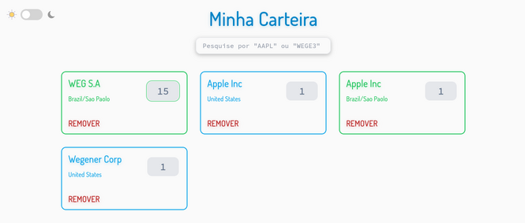
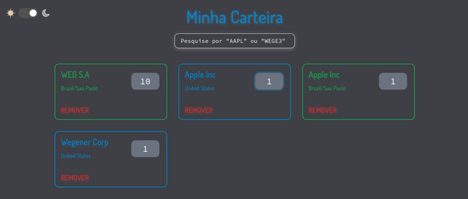

## `Simple Stocks Wallet Application`

This is a simple application used to apply knowledge and techniques learned about Full-Stack Web development.  
This application simulates a Stocks Wallet where you can store locally assets from a public Stocks Market API.  
The application fetches data from the [Alpha Vantage](https://www.alphavantage.co/) Web API.  

## Preview 

&#9728;  Light Theme  



&#9790;  Dark Theme  


## Features

- An asset is stored when the user presses enter with a keyword in the search bar;
- An asset will not be stored multiple times;
- Only assets from Brazil and USA are stored;
- The number of shares must be between 0 ~ 100;
- The asset card have an input to change the number of shares;
- The application supports dark mode and detects browser settings;

## Running the Application

Prior to run the application install the dependencies running the following command in the root folder:

```SH
npm run deps
```
This script runs `npm install` for all the project, where needed.

This project uses `docker-compose` to run all the environments.  
In the root folder, simply run the command:

```SH
$ docker-compose up
```

Open your browser, navigate to [http://localhost:3000](http://localhost:3000) and the page should be served.

**P.S:** if you run into some problem, you can try to run the services individually by running an instace of a mongodb and running  
`npm run dev` in the `<root_folder>/app` and `<root_folder>/api` folders.

## Frameworks and Dependencies

- Backend
  - Apollo GraphQL
  - Mongo DB

- Frontend
  - Next.JS
  - React
  - Tailwind

- Language
  - Typescript

- Dependencies
  - Docker Compose

## Contact

Mail me at genivalallan@hotmail.com.br
